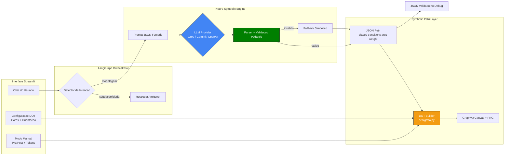

# SED Workspace - Abordagem Neuro-Simbólica com LangGraph

Aplicação em Streamlit para modelagem de Redes de Petri com dois modos:
- IA (pipeline neuro-simbólica)
- Manual (modelagem simbólica direta)

## Visão geral

Este projeto implementa uma abordagem **neuro-simbólica**:
1. O LLM interpreta texto livre do usuário.
2. O LLM retorna um **JSON estruturado** da Rede de Petri.
3. O backend valida esse JSON com **Pydantic**.
4. O motor simbólico gera o DOT/diagrama a partir da estrutura validada.

Orquestração feita com **LangGraph** no modo IA.

## Principais funcionalidades

- Chat lateral com histórico e resposta amigável.
- Classificação de intenção (saudação, curiosidade, piada, modelagem).
- Geração de Rede de Petri por texto natural (IA).
- Modo manual com:
  - padrão fixo;
  - personalizado (Pre/Post + tokens).
- Configuração DOT:
  - cor de fundo;
  - cor de desenho;
  - orientação horizontal/vertical.
- Peso de arcos no JSON e no DOT:
  - rótulo de peso aparece para peso > 1;
  - espessura do arco cresce com o peso.
- Download do grafo em PNG.

## Arquitetura

### Diagrama (Mermaid)



### Entry point
- `app.py`: inicialização da página e ciclo do connector.

### Configuração
- `src/app_config.py`: leitura de configurações da sidebar (cores e orientação DOT).

### UI e estado
- `src/ui/petri_ui_connector.py`:
  - controla a UI da sidebar/canvas;
  - mantém `session_state` por workspace;
  - integra chat + LangGraph + geração de DOT;
  - renderiza grafo e exportação PNG.

### Pipeline IA (LangGraph)
- `src/langgraph_chat.py`:
  - detecta intenção;
  - executa fluxo de geração neuro-simbólica;
  - retorna resposta amigável + DOT.

### Núcleo neuro-simbólico
- `src/neuro_symbolic.py`:
  - prompt para JSON forçado;
  - parser e validação Pydantic;
  - fallback determinístico;
  - resumo textual do modelo.

### Motor de grafo
- `sed/grafo.py`:
  - constrói grafo via modo manual;
  - constrói grafo a partir de JSON validado;
  - aplica tema, orientação e pesos de arcos no DOT.

### LLM Factory / Providers
- `sed/llm_factory.py`:
  - estratégias para OpenAI, Gemini e Groq;
  - suporte a `.env`;
  - fallback seguro quando SDK/chave não disponíveis.

## Fluxo do modo IA

1. Usuário envia mensagem no chat.
2. LangGraph classifica intenção.
3. Se for modelagem:
   - gera JSON (LLM);
   - valida schema;
   - gera DOT via motor simbólico;
   - renderiza no canvas.
4. Se não for modelagem (ex.: saudação):
   - responde no chat sem gerar grafo.

## Modelo JSON (resumo)

```json
{
  "places": [{"id":"p1","label":"P1","tokens":0}],
  "transitions": [{"id":"t1","label":"t1"}],
  "arcs": [{"source":"p1","target":"t1","weight":1}],
  "metadata": {"assumptions":[],"bounded":false}
}
```

## Requisitos

`requirements.txt`:
- streamlit>=1.28
- graphviz
- pandas
- langgraph
- streamlit-flow-component
- streamlit-float
- pydantic
- python-dotenv
- google-generativeai
- groq
- openai

Dependência de sistema (`packages.txt`):
- graphviz

## Variáveis de ambiente

Criar `.env` (exemplo):

```env
GROQ_API_KEY="..."
GOOGLE_API_KEY="..."
OPENAI_API_KEY="..."
```

## Execução local

```bash
python -m venv .venv
```

PowerShell:

```powershell
.\.venv\Scripts\Activate.ps1
```

Instalação:

```bash
pip install -r requirements.txt
```

Run:

```bash
streamlit run app.py
```

## Limitações atuais

- Qualidade do JSON depende do modelo escolhido e da cota disponível.
- Em falhas de SDK/cota/chave, o sistema usa fallback.
- Ainda não há persistência em banco (estado é em `session_state`).

## Estrutura de pastas

```text
.
|- app.py
|- README.md
|- requirements.txt
|- packages.txt
|- sed/
|  |- grafo.py
|  |- llm_factory.py
|  |- tags.py
|  |- ui_css.py
|- src/
   |- app_config.py
   |- langgraph_chat.py
   |- neuro_symbolic.py
   |- ui/
      |- petri_ui_connector.py
```
