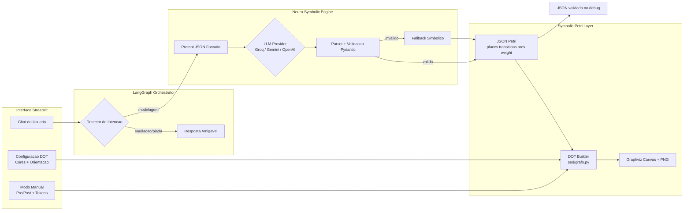

# SED Workspace - Neuro-Simbolico com LangGraph

Aplicacao em Streamlit para modelagem de Redes de Petri com dois modos:
- IA (pipeline neuro-simbolico)
- Manual (modelagem simbolica direta)

## Endpoint publico

https://projeto-ia-gengitgitpush-uoriginmain-nzaixzgsavp5ddkoeaposn.streamlit.app/

## Problema e solucao

O projeto resolve a modelagem de sistemas de eventos discretos a partir de texto natural, com saida formal em Rede de Petri.

Abordagem usada:
1. LLM interpreta o texto.
2. LLM retorna JSON estruturado da rede.
3. JSON e validado com Pydantic.
4. Camada simbolica gera DOT.
5. Graphviz renderiza o diagrama no canvas.

## Funcionalidades principais

- Chat lateral com historico e resposta amigavel.
- Classificacao de intencao (saudacao, piada, modelagem).
- Geracao IA via LangGraph + fluxo neuro-simbolico.
- Modo manual:
  - Padrao fixo.
  - Personalizado (Pre/Post + tokens).
- Configuracao DOT:
  - fundo;
  - desenho;
  - orientacao horizontal/vertical.
- Peso de arcos:
  - no JSON (`weight`);
  - no DOT (label para peso > 1 e espessura proporcional).
- Download PNG do grafo.

## Arquitetura (Mermaid)


```mermaid
graph LR
    subgraph "Interface Streamlit"
        A[Chat do Usuario]
        B[Configuracao DOT<br/>Cores + Orientacao]
        C[Modo Manual<br/>Pre/Post + Tokens]
    end

    subgraph "LangGraph Orchestrator"
        D{Detector de Intencao}
        E[Resposta Amigavel]
    end

    subgraph "Neuro-Symbolic Engine"
        F[Prompt JSON Forcado]
        G{LLM Provider<br/>Groq / Gemini / OpenAI}
        H[Parser + Validacao Pydantic]
        I[Fallback Simbolico]
    end

    subgraph "Symbolic Petri Layer"
        J[JSON Petri<br/>places transitions arcs weight]
        K[DOT Builder<br/>sed/grafo.py]
        L[Graphviz Canvas + PNG]
    end

    A --> D
    D -->|saudacao/piada| E
    D -->|modelagem| F
    F --> G
    G --> H
    H -->|valido| J
    H -->|invalido| I
    I --> J
    J --> K
    B --> K
    C --> K
    K --> L
    J --> M[JSON validado no debug]
```

## Componentes

- `app.py`: entrypoint Streamlit.
- `src/app_config.py`: config da sidebar (DOT/theme).
- `src/ui/petri_ui_connector.py`: UI, estado, chat, render e exportacao.
- `src/langgraph_chat.py`: orquestracao com LangGraph.
- `src/neuro_symbolic.py`: prompt JSON, parse e validacao Pydantic.
- `sed/grafo.py`: geracao DOT (manual + JSON validado).
- `sed/llm_factory.py`: providers e fallback de LLM.
- `sed/secrets.py`: leitura unificada local/nuvem (`st.secrets` + env).

## Fluxo IA

1. Usuario envia mensagem no chat.
2. LangGraph detecta intencao.
3. Em modelagem:
   - gera JSON no LLM;
   - valida schema;
   - aplica fallback se necessario;
   - gera DOT e renderiza.
4. Em saudacao/piada:
   - responde no chat sem gerar grafo.

## Exemplo de JSON

```json
{
  "places": [{"id": "p1", "label": "P1", "tokens": 0}],
  "transitions": [{"id": "t1", "label": "t1"}],
  "arcs": [{"source": "p1", "target": "t1", "weight": 1}],
  "metadata": {"assumptions": [], "bounded": false}
}
```

## Evidencias de uso de agente de codificacao

- Desenvolvimento iterativo com agente para:
  - refatoracao da arquitetura;
  - resolucao de erros de estado (`session_state`);
  - ajustes de UX no chat/sidebar/canvas;
  - implementacao do fluxo neuro-simbolico com LangGraph.
- O agente foi usado para:
  - criar e alterar modulos (`langgraph_chat.py`, `neuro_symbolic.py`, `secrets.py`);
  - evoluir schema JSON com pesos de arco;
  - integrar providers e fallback local/nuvem.

## Evidencia de engenharia de prompt

Este projeto nao usa prompt generico de chatbot. O prompt principal foi desenhado para forcar saida estruturada e compor um fluxo agentic:

- papel do modelo:
  - "compilador neuro-simbolico para Rede de Petri";
- formato de saida:
  - JSON valido e somente JSON (sem markdown);
- schema imposto:
  - `places`, `transitions`, `arcs` (com `weight`) e `metadata`;
- regras formais:
  - ids unicos;
  - arcos apenas entre lugar e transicao;
  - `tokens >= 0` e `weight >= 1`.

Resultado: o LLM nao responde "livre". Ele gera estrutura formal validavel, que alimenta a ferramenta grafica (DOT/Graphviz). Isso caracteriza agente orientado a tarefa, e nao plug-and-play de conversa.

## O que funcionou

- Pipeline neuro-simbolico ficou consistente: texto -> JSON -> validacao -> DOT.
- Modelo manual e IA convivem bem no mesmo workspace.
- Config DOT (cor/orientacao) aplicada em tempo real.
- Exportacao PNG funcional com fallback.

## O que deu errado e como foi corrigido

- Erros de `session_state` e update de widgets no Streamlit:
  - corrigidos com inicializacao centralizada no connector.
- Quotas/SDK de LLM (Gemini/Groq):
  - adicionados fallbacks e mensagens de diagnostico.
- HTML do chat renderizado como texto:
  - corrigido ajustando montagem do markdown/HTML.
- Mudancas de orientacao sem rotacionar transicao:
  - corrigido com retheme de `rankdir` + dimensoes de `shape=box`.

## Aplicacao em documentacao tecnica e academica

Esta arquitetura foi pensada para acelerar documentacao formal, nao apenas para interface visual.

Pontos de valor:
- geracao rapida de diagramas formais para trabalhos academicos;
- apoio a relatorios tecnicos com rastreabilidade (texto -> JSON -> DOT);
- padronizacao de modelos reutilizaveis entre projetos;
- integracao natural com ecossistema de documentacao (Markdown, LaTeX, PDF, SVG/PNG);
- reducao de trabalho manual em ferramentas puramente graficas.

Diferencial da escolha de motor:
- `Graphviz` atua como camada de baixo nivel e representacao formal;
- o diagrama deixa de ser apenas desenho e passa a ser artefato versionavel;
- facilita escalar para novos formatos (fluxograma, templates setoriais e bibliotecas de modelos).

## Configuracao de secrets (local e nuvem)

Local (`.env`):
```env
GROQ_API_KEY="..."
GOOGLE_API_KEY="..."
OPENAI_API_KEY="..."
```

Nuvem (Streamlit Cloud > Secrets):
```toml
GROQ_API_KEY="..."
GOOGLE_API_KEY="..."
OPENAI_API_KEY="..."
```

## Requisitos

- streamlit>=1.28
- graphviz
- pandas
- langgraph
- streamlit-flow-component
- streamlit-float
- pydantic
- python-dotenv
- google-generativeai
- groq
- openai

`packages.txt`:
- graphviz

## Executar localmente

```bash
python -m venv .venv
```

PowerShell:
```powershell
.\.venv\Scripts\Activate.ps1
```

Instalar dependencias:
```bash
pip install -r requirements.txt
```

Rodar:
```bash
streamlit run app.py
```

## Estrutura de pastas

```text
.
|- app.py
|- README.md
|- requirements.txt
|- packages.txt
|- sed/
|  |- grafo.py
|  |- llm_factory.py
|  |- secrets.py
|  |- tags.py
|  |- ui_css.py
|- src/
   |- app_config.py
   |- langgraph_chat.py
   |- neuro_symbolic.py
   |- ui/
      |- petri_ui_connector.py
```
